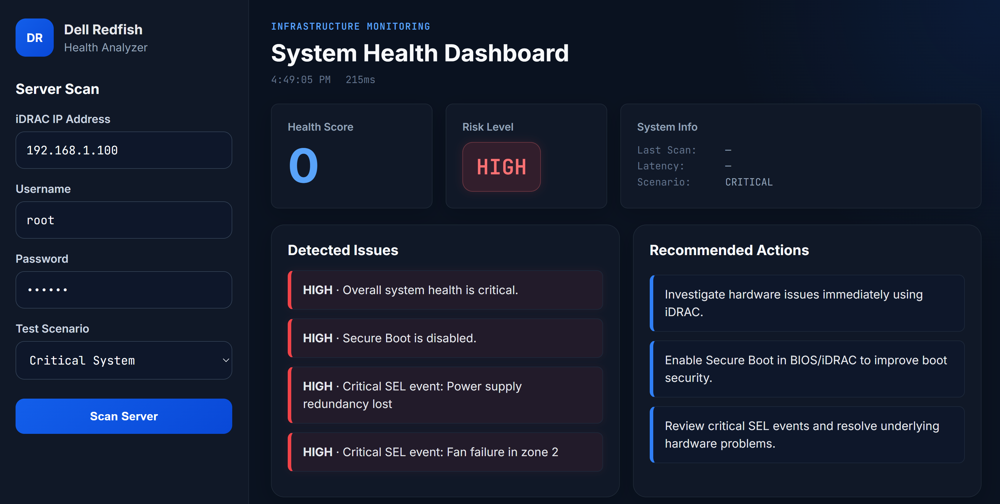

# Redfish Health Dashboard

Interactive full-stack dashboard for visualizing Redfish/iDRAC server health scans.

## Overview

This project simulates infrastructure health monitoring using a FastAPI backend and a responsive HTML/CSS/JavaScript frontend. It allows users to run mock server scans and view a health score, risk level, detected issues, and recommended actions.

## Screenshot



## Features

- FastAPI backend with `/scan` endpoint
- Scenario-based mock scans (healthy, warning, mixed, critical)
- Health scoring and risk classification
- Issue detection and remediation suggestions
- Dynamic dashboard UI with animated updates

## Tech Stack

- Python (FastAPI)
- HTML
- CSS
- JavaScript

## Project Structure

### Backend

```bash
cd backend
pip install -r requirements.txt

# Windows
py -m uvicorn app:app --reload

# Mac/Linux
python3 -m uvicorn app:app --reload

```

### Frontend

Open `frontend/index.html` using **VS Code Live Server**.

> In VS Code: right-click `index.html` → "Open with Live Server"
